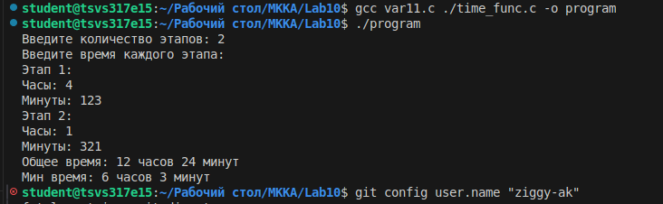

# Лабораторная работа №10: Структуры данных в языке C

# Вариант 11: Анализ времени этапов процесса

## Цель работы

Изучение принципов работы со структурами в языке C, освоение динамического выделения памяти, создание модульной программы с разделением на несколько файлов.

**Задание**

Создать структуру Time для хранения времени (часы, минуты). Для N этапов процесса определить:**

1. Общее время процесса
2. Минимальное время этапа

**Результат выполнения**

**В ходе выполнения лабораторной работы были изучены:**
· Принципы работы со структурами в языке C
· Методы динамического выделения памяти
· Техники создания модульных программ
· Особенности работы с указателями на структуры

Программа успешно решает поставленную задачу, соответствует всем требованиям задания и демонстрирует правильное использование структур данных в языке C.