# Лабораторная работа №9. Работа с Git

## Часть 1
**Шаг 1 (git status)**
Пояснение: Находимся на ветке `main`. Файлы в папке `lab9_git` пока не отслеживаются Git.

**Шаг 2 (git log)**
Пояснение: Указатели `HEAD` и `main` указывают на начальный коммит, а `origin/main` показывает, что локальная версия синхронизирована с GitHub.

**Шаг 3 (sort.c)**
Пояснение: Создал файл sort.c с функцией "Bubble" сортировки.

**Шаг 4 (git status)**
Пояснение: Git видит неотслеживаемые файлы (untracked files) в текущей папке

**Шаг 5-6 (git add)**
Пояснение: Все файлы в текущей папке перешли в состояние "Changes to be committed" (зелёный цвет). Это означает, что Git теперь отслеживает их изменения и они готовы к созданию коммита.

**Шаг 7-8: "Создание коммита" (git commit)**
Пояснение: Git сообщает, что локальная ветка `main` опережает удалённую `origin/main` на 1 коммит.

**Шаг 9-10: "Изменение файла sort.c"**
Пояснение: После добавления строки "// Лабораторная работа 9. Git." в файл sort.c, Git увидел это изменение и сообщил, что файл sort.c был изменён (выделен красным).

**Шаг 11-12: "Добавление изменений (git add sort.c)"**
Пояснение: Файл sort.c переместился из раздела "Changes not staged for commit" (красный) в "Changes to be committed" (зелёный). Это означает, что это изменение теперь находится в промежуточной области и будет сохранено при следующем коммите.

**Шаг 13-15: "2 изменение файла sort.c"**
Пояснение: 1.  `git status`: Показывает, что локальная ветка опережает удалённую на 2 коммита. Файл `sort.c` снова в состоянии "modified" (красный) — это наше второе изменение. Также есть неотслеживаемые скриншоты. 2.  `git log`: В истории теперь 3 коммита.

**Шаг 16-17: "Добавление изменений и отправка на удалённый репозиторий (git push)"**
Пояснение: Все коммиты были успешно отправлены. Строка `9102d98..f71bc80 main -> main` показывает диапазон отправленных коммитов и подтверждает, что ветка `main` на GitHub теперь синхронизирована с локальной.

## Часть 2

**Шаг 1-2: "Создание и переключение на ветку (git checkout -b mybranch)"**
Пояснение: Команда успешно создала новую ветку `mybranch` и автоматически переключила на неё. "*" звездочка указывает на ту ветку, на которой мы сейчас находимся.

**Шаг 3-4: "Шаг 3-4: Сравнение статуса в разных ветках"**
Пояснение: Первая строка `git status` всегда указывает текущую ветку. Ветка `mybranch` локальная, поэтому нет данных о синхронизации с GitHub.

**Шаг 5-8: "Добавление файла file1.txt, создание коммита в ветке mybranch"**
Пояснение:  Указатель `HEAD -> mybranch` находится на свежем коммите `b8145b3`, в то время как `main` остался на предыдущем коммите `f71bc80`. Ветки начали расходиться.

**Шаг 9-10: "Возврат в main и проверка истории"**
Пояснение:  После переключения на ветку main журнал коммитов показывает только 4 коммита, последний из которых - `f71bc80`. Коммит `b8145b3` (создание file1.txt), сделанный в mybranch, в истории main отсутствует.

**Шаг 11-12: "Добавление file2.txt, проверка что ветки указывают на разные коммиты"**
Пояснение:  Видно расхождение веток. После общего коммита `f71bc80` ветка `mybranch` идёт к коммиту `b8145b3` (с file1.txt), а ветка `main` — к коммиту `044a070` (с file2.txt). Это демонстрирует изоляцию и параллельное развитие веток.

**Шаг 13-15: "Сравнение веток и проверка отсутствия файлов"**
Пояснение:  Ветки содержат разные коммиты. Файл file2.txt, созданный в ветке main, отсутствует в рабочей папке после переключения на mybranch, что подтверждает изоляцию веток.

**Шаг 16-17: "Добавление скриншотов в ветку mybranch и отправление веток на удалённый репозиторий"**
Пояснение:  В удалённом репозитории теперь существуют две ветки (`main` и `mybranch`) с разной историей. Финальные скриншоты были добавлены в основную ветку main для единого отчёта.

## Часть 1. На оценку 4

**Шаг 1-4: "Работа в mybranch с sort.c"**  
Пояснение: Переключился на ветку mybranch, дополнил sort.c функцией main() с массивом. `git diff` показал изменения, `git diff --staged` был пуст — правки не в staged.

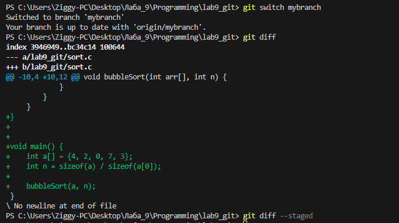

**Шаг 5-7: "Добавление в staged и сравнение diff"**  
Пояснение: После `git add sort.c` изменения переместились из рабочей директории в staged. `git diff` стал пустым , а `git diff --staged` показал те же изменения, что ранее показывал `git diff` (добавление функции main()). Это демонстрирует, как изменения переходят между областями.

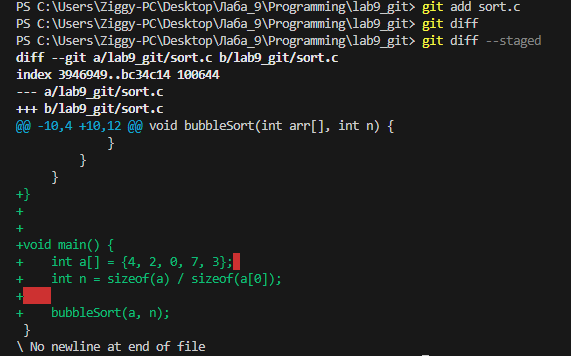

**Шаг 8-11: "Изменение массива и анализ diff"**  
Пояснение: Удалил число 4 из массива в sort.c. Теперь `git diff` показывает только это новое изменение (удаление числа), а `git diff --staged` показывает старое изменение (добавление main()). Файл имеет два состояния.

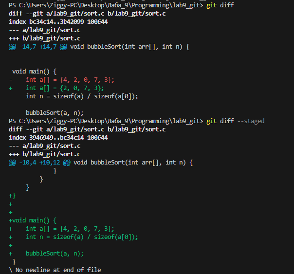

**Шаг 12-15: "Двойное состояние файла и фиксация изменений"**  
Пояснение: `git status` показал sort.c в двух разделах: изменения в staged (добавление main()) и в working directory (удаление числа). `git restore --staged` убрал файл из staged, объединив оба изменения. После добавления и коммита зафиксирована версия с массивом {2, 0, 7, 3}.

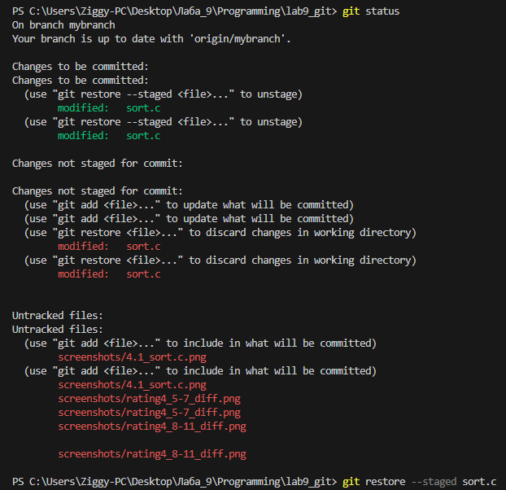
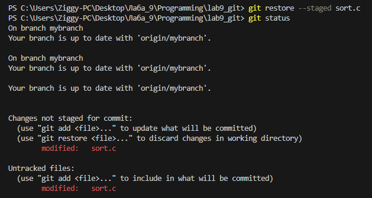

**Шаг 16: "Проверка журнала коммитов"**  
Пояснение: `git log --oneline` показывает три последних коммита в ветке mybranch. Последний коммит `ec2f3d3` это добавление функции main(), предыдущие работа с file1.txt и sort.c. Ветка mybranch опережает origin/mybranch на 1 коммит.

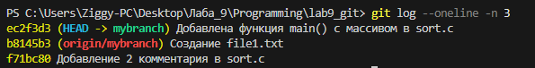

**Шаг 17-22: "Работа с git restore"**  
Пояснение: Добавил в sort.c строку printf("hello git\n");. `git status` показал изменение. Команда `git restore sort.c` откатила файл к состоянию последнего коммита и добавленная строка исчезла. `git restore` позволяет безопасно отменять незакоммиченные изменения в рабочей директории.

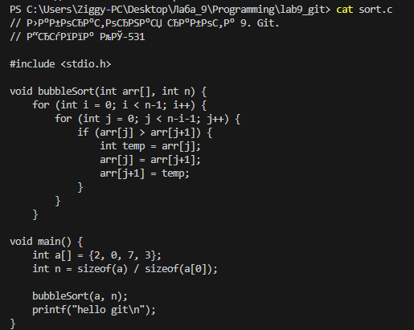
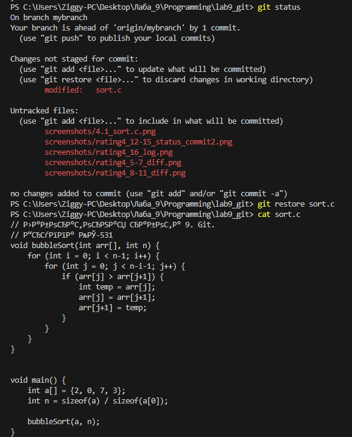
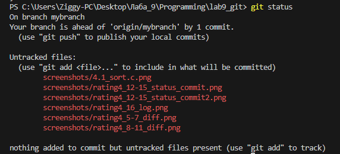

**Шаг 23: "Отправка ветки mybranch на GitHub"**  
Пояснение: `git push origin mybranch` отправил все локальные коммиты ветки на удалённый репозиторий. 

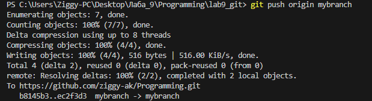

## Часть 2. На оценку 4

**Шаг 1-5: "Создание новой ветки и файла"**  
Пояснение: В ветке main создал файл greeting.txt (пустой), закоммитил. Затем добавил в него "hello" и закоммитил. После этого создал новую ветку feature/uppercase.

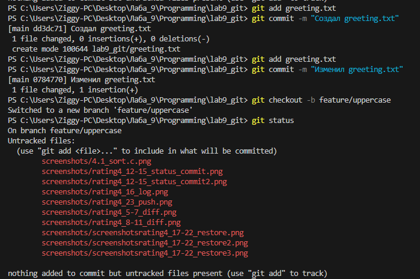

**Шаг 6-11: "Работа в ветке feature/uppercase"**  
Пояснение: В ветке feature/uppercase изменил greeting.txt на "HELLO" (верхний регистр), закоммитил. `git branch` показывает три ветки, `git log --oneline --graph --all` показывает историю: feature/uppercase опережает main на 1 коммит. После переключения на main, файл greeting.txt содержит "hello" (нижний регистр).

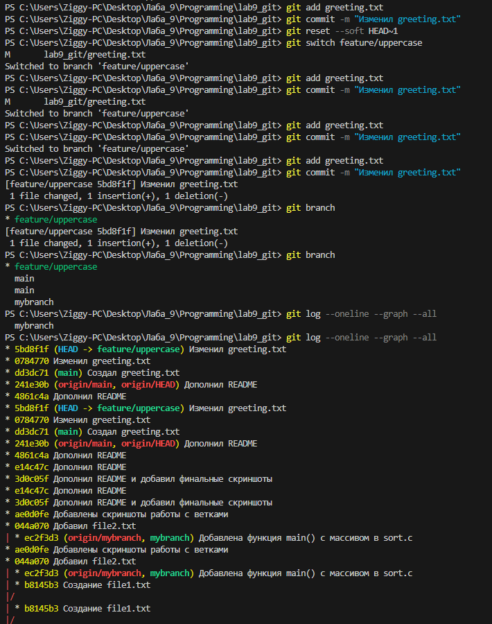
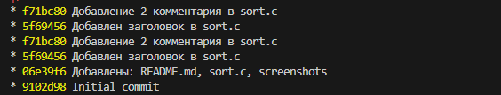
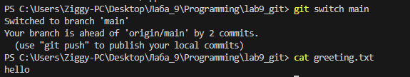

**Шаг 12-15: "Сравнение веток и разрешение конфликта при merge"**  
Пояснение: `git diff` показал разницу: в main было "hello", в feature/uppercase "HELLO". При merge возник конфликт. Файл greeting.txt содержал конфликтные маркеры. После редактирования (оставлена версия "hello") и коммита слияние завершено. Ветка feature/uppercase удалена.

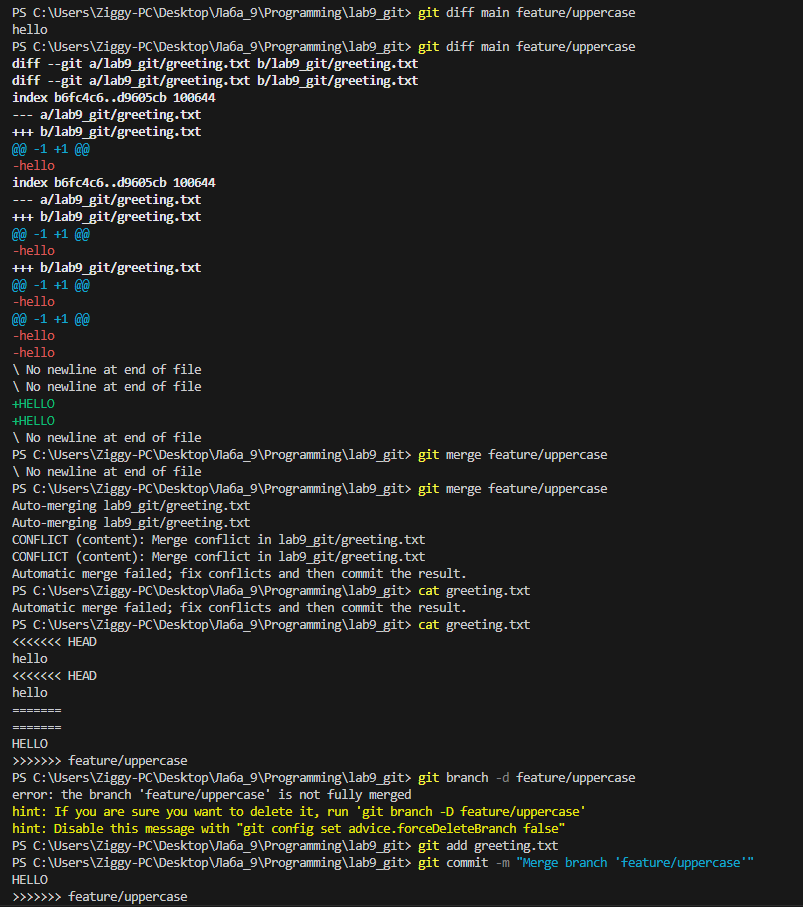

**Шаг 16-19: "Слияние с mybranch "**  
Пояснение: При слиянии `git merge mybranch` возник конфликт в файлах скриншотов. Конфликт разрешён удалением проблемного файла. `git log --oneline --graph --all` показывает объединённую историю всех веток.

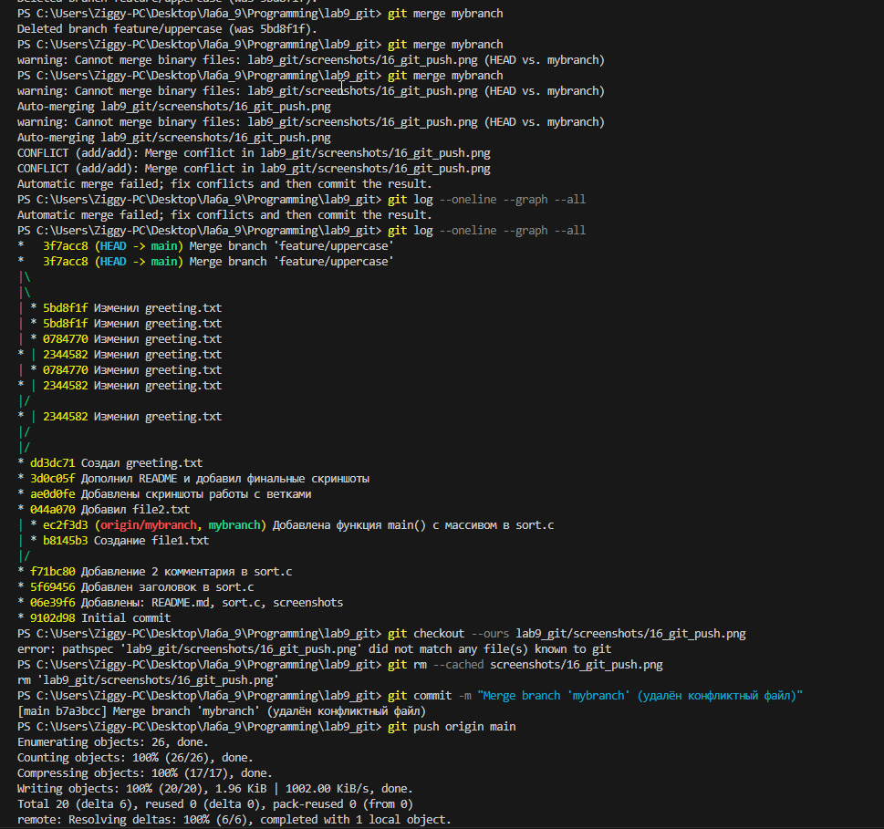
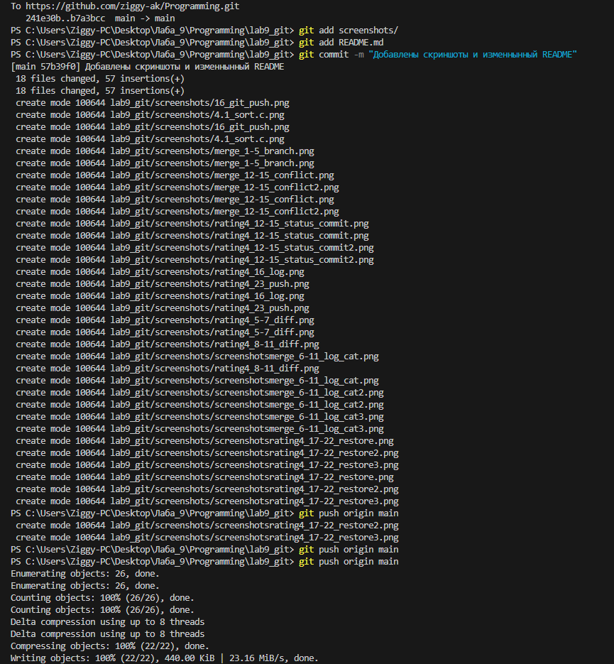