# Лабораторная работа №9. Работа с Git

## Часть 1
**Шаг 1 (git status)**
Пояснение: Находимся на ветке `main`. Файлы в папке `lab9_git` пока не отслеживаются Git.

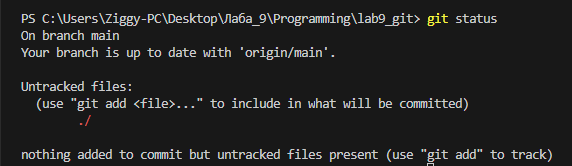

**Шаг 2 (git log)**
Пояснение: Указатели `HEAD` и `main` указывают на начальный коммит, а `origin/main` показывает, что локальная версия синхронизирована с GitHub.

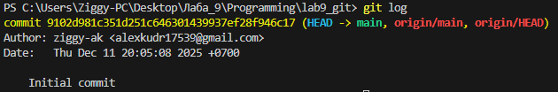

**Шаг 3 (sort.c)**
Пояснение: Создал файл sort.c с функцией "Bubble" сортировки.

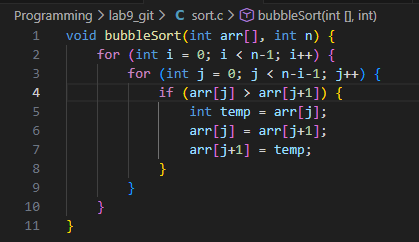

**Шаг 4 (git status)**
Пояснение: Git видит неотслеживаемые файлы (untracked files) в текущей папке

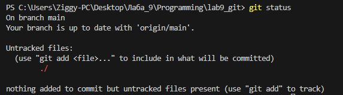

**Шаг 5-6 (git add)**
Пояснение: Все файлы в текущей папке перешли в состояние "Changes to be committed" (зелёный цвет). Это означает, что Git теперь отслеживает их изменения и они готовы к созданию коммита.

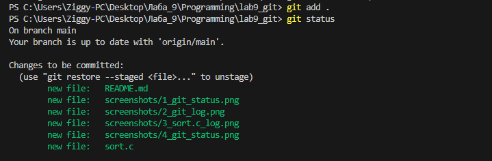

**Шаг 7-8: "Создание коммита" (git commit)**
Пояснение: Git сообщает, что локальная ветка `main` опережает удалённую `origin/main` на 1 коммит.

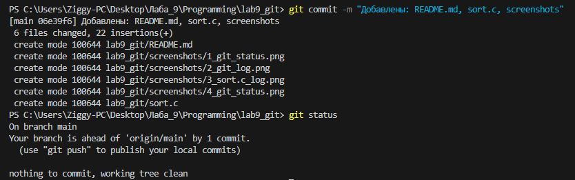

**Шаг 9-10: "Изменение файла sort.c"**
Пояснение: После добавления строки "// Лабораторная работа 9. Git." в файл sort.c, Git увидел это изменение и сообщил, что файл sort.c был изменён (выделен красным).

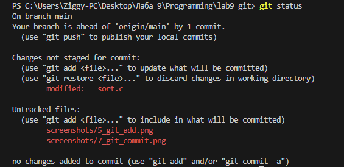

**Шаг 11-12: "Добавление изменений (git add sort.c)"**
Пояснение: Файл sort.c переместился из раздела "Changes not staged for commit" (красный) в "Changes to be committed" (зелёный). Это означает, что это изменение теперь находится в промежуточной области и будет сохранено при следующем коммите.

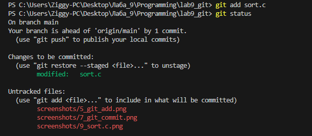

**Шаг 13-15: "2 изменение файла sort.c"**
Пояснение: 1.  `git status`: Показывает, что локальная ветка опережает удалённую на 2 коммита. Файл `sort.c` снова в состоянии "modified" (красный) — это наше второе изменение. Также есть неотслеживаемые скриншоты. 2.  `git log`: В истории теперь 3 коммита.

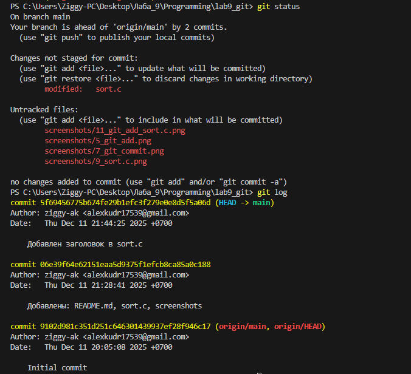

**Шаг 16-17: "Добавление изменений и отправка на удалённый репозиторий (git push)"**
Пояснение: Все коммиты были успешно отправлены. Строка `9102d98..f71bc80 main -> main` показывает диапазон отправленных коммитов и подтверждает, что ветка `main` на GitHub теперь синхронизирована с локальной.

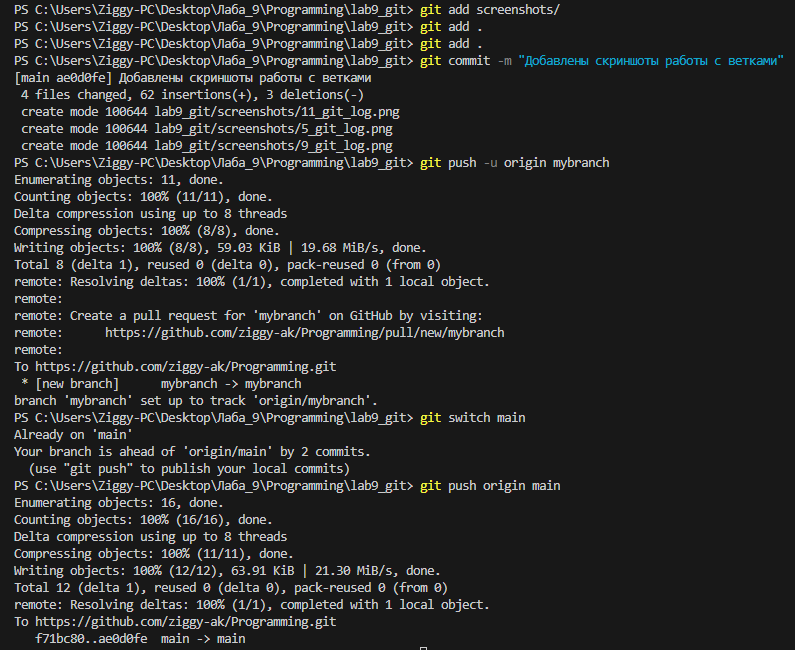

## Часть 2

**Шаг 1-2: "Создание и переключение на ветку (git checkout -b mybranch)"**
Пояснение: Команда успешно создала новую ветку `mybranch` и автоматически переключила на неё. "*" звездочка указывает на ту ветку, на которой мы сейчас находимся.

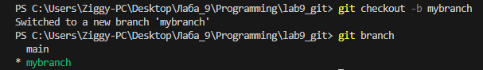

**Шаг 3-4: "Шаг 3-4: Сравнение статуса в разных ветках"**
Пояснение: Первая строка `git status` всегда указывает текущую ветку. Ветка `mybranch` локальная, поэтому нет данных о синхронизации с GitHub.

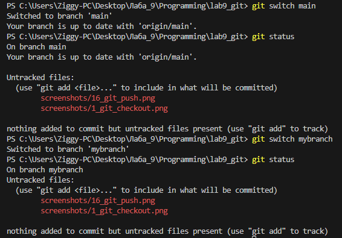

**Шаг 5-8: "Добавление файла file1.txt, создание коммита в ветке mybranch"**
Пояснение:  Указатель `HEAD -> mybranch` находится на свежем коммите `b8145b3`, в то время как `main` остался на предыдущем коммите `f71bc80`. Ветки начали расходиться.

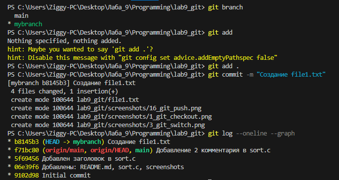

**Шаг 9-10: "Возврат в main и проверка истории"**
Пояснение:  После переключения на ветку main журнал коммитов показывает только 4 коммита, последний из которых - `f71bc80`. Коммит `b8145b3` (создание file1.txt), сделанный в mybranch, в истории main отсутствует.

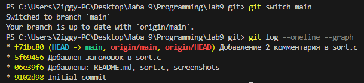

**Шаг 11-12: "Добавление file2.txt, проверка что ветки указывают на разные коммиты"**
Пояснение:  Видно расхождение веток. После общего коммита `f71bc80` ветка `mybranch` идёт к коммиту `b8145b3` (с file1.txt), а ветка `main` — к коммиту `044a070` (с file2.txt). Это демонстрирует изоляцию и параллельное развитие веток.

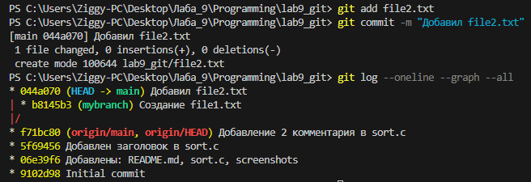

**Шаг 13-15: "Сравнение веток и проверка отсутствия файлов"**
Пояснение:  Ветки содержат разные коммиты. Файл file2.txt, созданный в ветке main, отсутствует в рабочей папке после переключения на mybranch, что подтверждает изоляцию веток.

**Шаг 16-17: "Добавление скриншотов в ветку mybranch и отправление веток на удалённый репозиторий"**
Пояснение:  В удалённом репозитории теперь существуют две ветки (`main` и `mybranch`) с разной историей. Финальные скриншоты были добавлены в основную ветку main для единого отчёта.

